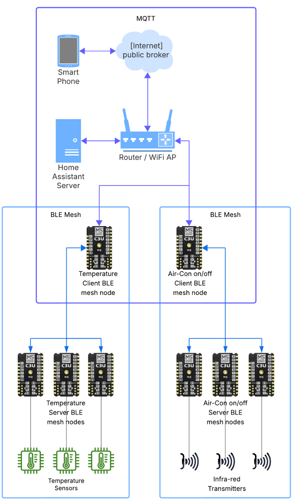

# CSC2106 Group 7: BLE Mesh MQTT Smart Home Air Conditioner Retrofit

This project implements a system to retrofit traditional air conditioners with smart functionality using BLE Mesh, MQTT, and ESP32 devices. The system provides unified control, monitoring, and automation capabilities through Home Assistant integration.

## Project Overview

Our solution creates a wireless mesh network of ESP32 devices to monitor room conditions and control non-smart air conditioners through infrared (IR) signals. The system connects to Home Assistant via MQTT, enabling smart features like:

* Remote control of existing air conditioners from anywhere
* Temperature and humidity monitoring
* Automated climate control based on sensor data
* Integration with other smart home systems and voice assistants
* Energy usage optimization

## System Architecture

The system consists of four main components:

* MQTT/BLE Mesh Gateways - Bridge between Home Assistant and BLE Mesh network
* IR Control Nodes - Control air conditioners via infrared signals
* Sensor Nodes - Monitor temperature and humidity
* Home Assistant - Central management platform with MQTT broker

## Project Structure

The repository contains ESP-IDF code for the following components:

* `blemesh-mqtt-onoff-client`: BLE Mesh client that receives MQTT commands and forwards them to control nodes
* `blemesh-mqtt-onoff-server`: BLE Mesh server with IR capabilities that controls air conditioners
* `blemesh-mqtt-sensor-client`: BLE Mesh client that collects sensor data and publishes to MQTT
* `blemesh-mqtt-sensor-server`: BLE Mesh server with DHT22 sensor for temperature/humidity monitoring

## Hardware Requirements

* ESP32-C3 Boards - M5Stamp-C3 or similar (minimum 4 devices recommended)
* Sensors
    * DHT22 temperature/humidity sensors
    * IR transmitters (e.g., KY-005) for AC control
    * Optional: IR receivers for learning remote codes
* Power Supply - USB or battery power for ESP32 devices
* Home Assistant Server - Raspberry Pi 4 (2GB+ RAM recommended)
* Network - WiFi network for MQTT communication

## Software Requirements

* ESP-IDF (v5.1 or newer)
* Arduino Core for ESP32 (as ESP-IDF component)
* MQTT Broker - Mosquitto (included with Home Assistant)
* Home Assistant - Latest version
* Development Environment - VSCode with ESP-IDF extension recommended

## Setup and Installation

1. **Prepare Home Assistant**
     * Install Home Assistant OS on Raspberry Pi
     * Enable MQTT integration
     * Install required add-ons:
         * Mosquitto broker
         * File editor (optional)
         * Terminal & SSH (optional)

2. **Set Up ESP-IDF Environment**
     * Follow the official Espressif instructions to install ESP-IDF on your development machine.

3. **Clone This Repository**

4. **Build and Flash Components**
     * For each component:
         * Navigate to component folder: `cd <component_folder>`
         * Configure: `idf.py menuconfig` (Set Wi-Fi, MQTT, GPIO pins, etc.)
         * Build: `idf.py build`
         * Flash: `idf.py -p PORT flash` (Replace PORT with device serial port)
         * Monitor: `idf.py -p PORT monitor`

5. **Hardware Assembly**
     * Sensor Nodes: Connect DHT22 sensor to configured GPIO pin (default GPIO4)
     * Control Nodes: Connect IR LED to configured GPIO pin
     * Power all devices and ensure they're within BLE range of each other

## Usage

* Power on all devices - Ensure gateways connect to WiFi and MQTT broker
* Provision the BLE Mesh network - Gateways will automatically discover and provision server nodes
* Configure Home Assistant - Add the MQTT entities for sensors and switches
* Control & Monitor - Use Home Assistant UI, automations, or integrations to control ACs and monitor temperature

## Troubleshooting

* WiFi Connectivity Issues: Verify credentials in menuconfig
* MQTT Connection Problems: Check broker address and credentials
* BLE Mesh Provisioning Failures: Ensure devices are within range
* IR Control Issues: Verify IR LED connection and positioning
* Sensor Reading Problems: Check DHT22 wiring and power

## Authors (Group 7)

* James Patrick Francisco Gonzales
* Jiang Weimin
* Chew Liang Zhi
* Leo Oh Kang Weng
* Joween Ang

## License

MIT License

## Acknowledgments

Based on ESP-IDF BLE Mesh examples and Arduino libraries for sensor and IR control functionality.
